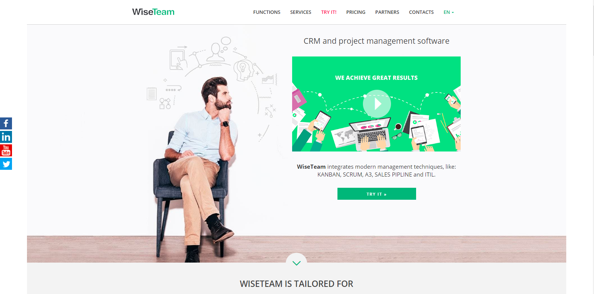
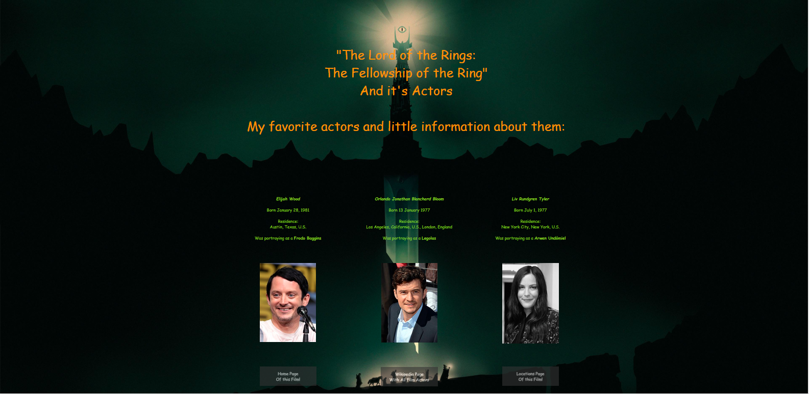
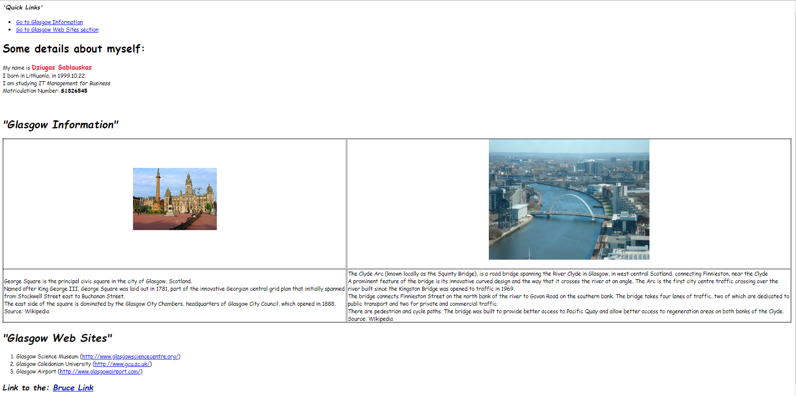

<head>
    <title>DS Portfolio</title>
    <!-- Required meta tags -->
    <meta charset="utf-8">
    <meta name="viewport" content="width=device-width, initial-scale=1, shrink-to-fit=no">

    <!-- Bootstrap CSS -->
    <link rel="stylesheet" href="https://stackpath.bootstrapcdn.com/bootstrap/4.3.1/css/bootstrap.min.css"
        integrity="sha384-ggOyR0iXCbMQv3Xipma34MD+dH/1fQ784/j6cY/iJTQUOhcWr7x9JvoRxT2MZw1T" crossorigin="anonymous">

    <link rel="stylesheet" href="https://stackpath.bootstrapcdn.com/font-awesome/4.7.0/css/font-awesome.min.css">
    <link rel="stylesheet" href="https://fonts.googleapis.com/css?family=Montserrat:400,700,900&display=swap">

    
</head>

<body>
    

    <!--
    <nav class="navbar navbar-expand-lg fixed-top">
        

            <a class="navbar-brand" href="#">DS-P</a>
            <button class="navbar-toggler d-lg-none" type="button" data-toggle="collapse"
                data-target="#collapsibleNavId" aria-controls="collapsibleNavId" aria-expanded="false"
                aria-label="Toggle navigation">
                <i class="fa fa-bars"></i>
            </button>

            

                <ul class="nav">
                    <li class="nav-item active">
                        <a class="nav-link" href="#">About Us (current)</a>
                    </li>
                    <li class="nav-item">
                        <a class="nav-link" href="#">Pricing</a>
                    </li>
                    <li class="nav-item">
                        <a class="nav-link" href="#">Team</a>
                    </li>
                    <li class="nav-item">
                        <a class="nav-link" href="#">Services</a>
                    </li>
                    <li class="nav-item">
                        <a class="nav-link" href="#">Gallery</a>
                    </li>
                    <li class="nav-item">
                        <a class="nav-link btn-outline-secondary" href="#">Contact Us</a>
                    </li>
                </ul>
            

        

    </nav>
    -->

    <!--Home-->
    <section class="home container">
        

            

                
            

            

                

                    

                        <h1 class="animated slideInLeft delay-1s pb-3 tblue"><em>Dziugas Sablauskas</em></h1>
                        
<strong>Hi,</strong> I am an IT Management for Business student in Glasgow Caledonian University <i class="fa fa-university" aria-hidden="true"></i>  
                        In studies we are introduced with IT widely, but mostly I like Web development and this is where I spend part of my free time. I've made few Web projects for companies and ofcourse had some of them built for studies or myself.

                        <button class="animated zoomIn delay-3s btn btn-lg btn-outline-secondary tred" onclick="window.location.href = 'about.html';">Read More</button>
                        <button class="animated zoomIn delay-3s btn btn-lg btn-secondary tblue" onclick="window.location.href = 'contact.html';">Contact Me</button>
                    

                

            

        

    </section>

    <!--Call to action
    <section class="call-to-action py-5">
        

            <h2 class="animated slideInDown py-3 tred">Call to action</h2>
            

            
dsf oijsdfi oidsfj odsi oifdso ids oijnawdn aw danwdo dwaoi mowadm awd wamod mowadimwad
                oaiwmd owaimdomw fsosifd nmfd

            <button class="btn btn-lg btn-primary tblue">Learn more</button>
        

    </section>
    //-->

    <!--Services-->
    <section class="services opas">
        

            <h1 class="py-3 tred">Skills</h1>
            

        

        

            

                

                    <i class="fa fa-html5" aria-hidden="true"></i>
                    <h4 class="py-3 tred">HTML 5</h4>
                    
Have advanced understand and ability to write code in HTML

                

                

                    <i class="fa fa-css3"></i>
                    <h4 class="py-3 tred">CSS 3</h4>
                    
Cascading Style Sheet is where I feel like it's must to spend enought time as it is one of main reason why code looks great

                

                

                    <i class="fa fa-code"></i>
                    <h4 class="py-3 tred">JavaScript</h4>
                    
Believe, that for web developer it's one of the most important things to know, so I spend most of my time to improve my JavaScript writing

                

                

                    <i class="fa fa-bars"></i>
                    <h4 class="py-3 tred">Bootstrap</h4>
                    
Have built few websites with bootstrap, so already have perception of how i works

                

                

                    <i class="fa fa-picture-o" aria-hidden="true"></i>
                    <h4 class="py-3 tred">Gimp</h4>
                    
Able to simply manipulate or edit images using Gimp

                

                

                    <i class="fa fa-cog" aria-hidden="true"></i>
                    <h4 class="py-3 tred">Back End</h4>
                    
Have enough experience with Java, to write intermediate code. Also had past experience with C++

                

                

                    <i class="fa fa-bug"></i>
                    
Bug Fixing

                    
Able to debug, find and resolve defects  that prevent correct operation within front end or back end codes

                

                

                    <i class="fa fa-laptop"></i>
                    <h4 class="py-3 tred">Google'ing</h4>
                    
Always believed, the key to programming is the ability to search for information

                

            

        

    </section>

    <!--Portfolio-->
    <section class="portfolio container-fluid opas">
        

            <h1 class="py-3 tred">Portfolio</h1>
            

        

        

            

                
                <h3 class="pl-2 pt-3">WiseTeam</h3>
                Client Project
            

            

            

                
                <h3 class="pl-2 pt-3">IK Consulting</h3>
                Client Project
            

        

        

            

            

                
                <h3 class="pl-2 pt-3">Soft Consulting</h3>
                Client Project
            

            

            

                
                <h3 class="pl-2 pt-3">Review Actors</h3>
                College Project
            

            

        

        

            

            

                
                <h3 class="pl-2 pt-3">First Website</h3>
                College Project
            

            

            

                
                <h3 class="pl-2 pt-3">Grozio Studija</h3>
                Personal Project
            

            

        

    </section>

    <!--Contact Us
    <section class="contact">
        

            

                <h2 class="py-3 tred">Contact Us</h2>
                

            

            

                

                    <!--Google Map
                    <iframe src="https://www.google.com/maps/embed?pb=!1m18!1m12!1m3!1d2304.7583810627384!2d25.180257315766674!3d54.713873979100306!2m3!1f0!2f0!3f0!3m2!1i1024!2i768!4f13.1!3m3!1m2!1s0x46dd9225778aec4b%3A0xe4bf73afe85c55d!2s%C4%AEsruties%20g.%202%2C%20Vilnius%2006244!5e0!3m2!1sen!2slt!4v1576351027121!5m2!1sen!2slt"></iframe>                    
                

                <form class="col-lg-6">
                    

                        <label for="email">Email</label>
                        <input id="email" class="form-control" type="email" aria-describedby="emailHint"
                            placeholder="Enter email...">
                        <small id="emailHint" class="form-text text-muted">We'll never share your email with anyone
                            else.</small>
                    

                    

                        <label for="name">Name</label>
                        <input id="name" class="form-control" type="name" placeholder="Enter name...">
                    

                    

                        <label for="message">Message</label>
                        <textarea id="message" class="form-control" placeholder="Enter message..." rows="5"></textarea>
                    

                    <button type="submit" class="btn btn-lg btn-outline-secondary">Submit</button>
                </form>
            

        

    </section>
    //-->

    <!--Footer-->
    <footer class="footer mt-5">
            

                <h3 class="py-3">DS-Projects</h3>
                

            

            

                
<b>Always Seeking to Learn More</b>

                

                    <a href="https://www.facebook.com/profile.php?id=100007791466332" target="_blank"> <i class="fa fa-facebook-official" aria-hidden="true"></i></a>
                    <a href="https://www.instagram.com/sablauskas.cia/" target="_blank"> <i class="fa fa-instagram" aria-hidden="true"></i></a>
                    <a href="https://www.linkedin.com/in/dziugas-sablauskas-933417170/" target="_blank"> <i class="fa fa-linkedin-square" aria-hidden="true"></i></a>
                

            

    </footer>
    <!-- Optional JavaScript -->
    <!-- jQuery first, then Popper.js, then Bootstrap JS -->
    
    
    

</body>
